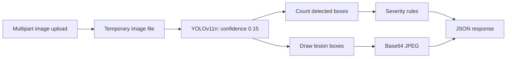

# AcneScan AI — Backend

**A FastAPI inference service for acne lesion detection and count-based severity classification.**

[Open AcneScan AI](https://acnescanai.vercel.app) · [Frontend repository](https://github.com/Dylm54/TA_Frontend) · [Developer portfolio](https://mrhdyath.vercel.app)

This service receives a facial photo, detects acne lesions with YOLOv11n, maps the lesion count to four severity categories, and returns an annotated image for the AcneScan AI web interface.

AcneScan AI was developed as an academic research project, presented and published at an IEEE conference.

> Intended for preliminary self-screening and research only. The output is not a medical diagnosis or a substitute for assessment by a qualified healthcare professional.

<!-- Add the paper title, authors, conference, year, and DOI link when available. -->

## Highlights

- **YOLOv11n inference:** Uses trained weights from `model/best.pt` with a confidence threshold of `0.15`.
- **Count-based severity mapping:** Converts the number of detected lesions into Mild, Moderate, Severe, or Very Severe.
- **Annotated results:** Returns a base64-encoded JPEG with lesion bounding boxes, plus count and severity.
- **Multipart API:** Exposes a single prediction endpoint for browser uploads.
- **Deployment:** Includes a Dockerfile configured to serve FastAPI on port `7860`.
- **Runtime measurements:** Logs processing-stage durations and process memory usage.

## Inference pipeline



### Severity rules in the implementation

[`main.py`](main.py) applies the following project mapping, described in the research as based on the Hayashi Criteria:

| Detected lesion count | Returned category |
| --- | --- |
| 0–5 | Mild |
| 6–20 | Moderate |
| 21–50 | Severe |
| 51 or more | Very Severe |

The current implementation maps zero detections to **Mild**; it has no separate “no acne,” “invalid photo,” or “inconclusive” category. These are software rules and should not be interpreted as independent clinical validation of the input or result.

## Technology and training context

| Component | Technology or research configuration |
| --- | --- |
| API | Python, FastAPI, Uvicorn |
| Detection | Ultralytics YOLOv11n, PyTorch |
| Image processing | OpenCV |
| Upload handling | `python-multipart` |
| Runtime memory logging | `psutil` |
| Training dataset | ACNE04 — 1,457 facial images, as reported in the project study |
| Training | 100 epochs on Kaggle with a Tesla T4 GPU |
| Model size | Reported 2.58M parameters and 6.3 GFLOPs |
| Research deployment | Hugging Face Spaces, CPU instance |

This repository serves the trained model. The training configuration above describes the research; it does not imply that training and preprocessing scripts are included here.

## API reference

### `POST /predict`

Send a valid image as `multipart/form-data` under the required field `file`.

Example response shape; values are illustrative:

```json
{
  "lesion_count": 14,
  "severity": "Moderate",
  "image": "<base64-encoded JPEG>"
}
```

| Field | Type | Description |
| --- | --- | --- |
| `lesion_count` | integer | Number of detected bounding boxes |
| `severity` | string | Category produced by the count-based rules |
| `image` | string | Annotated JPEG encoded as base64, without a data-URL prefix |

The response does not expose individual box coordinates or confidence scores. The handler saves the upload to a temporary file and attempts to remove it in a `finally` block after processing. This behavior is not an end-to-end data-retention guarantee for the hosting infrastructure.

## Reported research performance

These figures come from the project research summary. They have not been reproduced by this README.

### Lesion detection

| Metric | Reported result |
| --- | --- |
| Precision | 0.451 |
| Recall | 0.432 |
| mAP@0.5 | 0.334 |
| Model inference time | 2.6 ms/image |

The 2.6 ms figure is an experimental model benchmark, not measured end-to-end latency for the Hugging Face CPU deployment. The supplied summary does not specify the full timing conditions. Uploads, preprocessing, image encoding, network time, and cold starts contribute additional latency.

### Severity classification

| Metric | Reported result |
| --- | --- |
| Accuracy | Approximately 78% |
| Weighted F1 | 0.78 |
| Selected confidence threshold | 0.15 |
| Accuracy during the threshold comparison at 0.15 | 78.2% |
| Severe-category F1 | 0.63 |

Detection quality and severity accuracy measure different tasks. Count-based grading can remain correct despite some missed or extra detections when the count stays within the same severity interval. This does not establish reliable lesion localization or clinical diagnostic accuracy.

## Engineering and research lessons

**Tune for the downstream task.** Five confidence thresholds were compared. At `0.25`, underdetection reduced the reported weighted F1 to `0.530`; at `0.10`, overcounting could move borderline cases into higher severity categories. The implementation uses `0.15`, selected for severity classification accuracy.

**Keep model selection separate from final evaluation.** The supplied study description states that threshold selection and reporting used the same test set. These figures therefore reflect a tuned evaluation and may be optimistic. Future evaluation should select the threshold on validation data and report final results on a separate untouched test set.

**Account for imbalance and boundary errors.** The research reports class imbalance, the lowest per-class F1 in the Severe category, and frequent Mild–Moderate and Moderate–Severe boundary errors. Small lesions also remained difficult to localize.

**Measure deployment latency separately.** The research deployment experienced cold starts after inactivity, which appeared in user feedback about slow initial responses. Model benchmark speed alone does not describe the user experience on a hosted CPU service.

## Scope and limitations

- The model can miss lesions or detect false positives; outputs depend on image conditions and the training data distribution.
- The current endpoint does not explicitly validate that an uploaded image contains a suitable face or enforce a file-size limit.
- CORS is configured for development with all origins allowed, and the endpoint has no application-level authentication or rate limiting.
- The current severity mapping includes no uncertainty or abstention mechanism.
- Generalization beyond the study data requires independent evaluation.

The companion frontend's usability evaluation involved 71 respondents and reported a mean SUS score of 75.11. This supports the study's usability findings, not clinical effectiveness.

## Future work

- Separate validation-based threshold selection from held-out testing.
- Improve performance for underrepresented severity categories.
- Add input validation and clearer handling of unsuitable images.
- Evaluate warm and cold end-to-end latency on the deployment hardware.
- Support the product improvements identified in user feedback: photo guidance, scan history, and result export.
